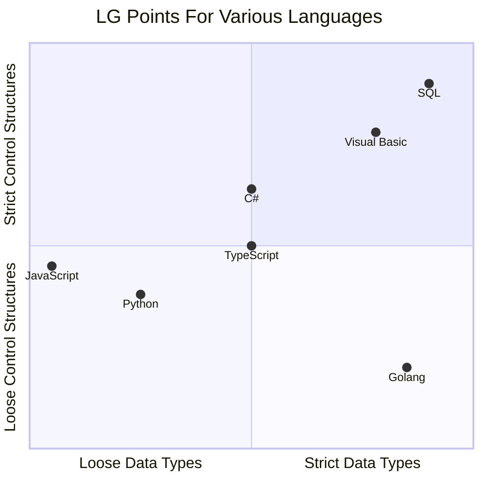

+++
date = '2025-04-21T20:26:26-05:00'
draft = false
title = 'Lg Points'
tags = []
categories = []
+++

I was working with ChatGPT to better understand Golang, and I asked it about inheritance with interfaces. It spit out the following gem. It made me think though, can you define aspects of languages as more loosey goosey than others? We'll explore that in this post.


## What is loosey goosey?

What do I mean by "loosey goosey" is the first question you're probably thinking of. We'll start with the first definition I thought of, which is simply "how strict is the data(and types) in a language..." A good example is JavaScript. Below is completely valid code:

```javascript
let x = 2
console.log(x, typeof(x))
if(x > 0){
	x = false
}
console.log(x, typeof(x))
if(!x){
	x = "error on x"
}
console.log(x, typeof(x))
```

Note how the variable `x` started life as an int, then became a boolean, then finally a string. This can be very useful in some cases, but it's a double edge sword with some very strange errors. I think this highlights the initial definition very well: your data is very flexible in what it can be. 
### What is a LG Point?

So we've defined `loosey goosey` as a property of data type transience in a language, but that's only one point of data. That's where the expanded definition of `loosey goosey` comes to play: it's a measure of how strict (or not) that a languages data *or* control structures are. Let me elaborate on this a bit with some examples.

One of the most basic control structures is the `for` loop, generally it looks like this:
```javascript
for(var i = 0; i < 10; i++){
	doSomething(i);
}
```

You'll find this syntax works in a good deal of languages, like C#, JavaScript, Golang, Python, etc. But some languages expand on that control structure. A good example is Python:
```python
arr = [1, 3, 5, 2, 0, 4]

for i, v in enumerate(arr):
	print(i, v)
```

Note in this example we're skipping a formal declaration of how far we're iterating, we're just iterating over the entire array. We also have multiple variables here, one of the key (i) and one for the value of the array at i (v). In terms of strictness, this allows deviation from the formal `for` loop implementation. Golang takes this one step further, which is where I got the idea that data and control structures can be `loosey goosey`
```go
for{
	//this is technically an infinite loop
	doSomething()
}
```

As you can see above, Golang allows you to exclude everything from the `for` initialization and make it an infinite loop. 

Now we have two data points for `loosey goosey` ness, or what could be a a point on an (x,y) graph. Below is an example of what I think of certain languages, though this isn't an exhaustive list by any means. These are my LG points, a measure of how strict or loose a language is based on its data types and its control structures. 


Here is the mermaidjs that generates the above image...



*I was surprised I landed at TypeScript in the center as well...*
## Why is this good for helping choose a language?
So why do these LG points matter? Besides being able to nerd out and make a graph, I think that this plays into picking a language for a project. When you start as an engineer you'll use the language you know best. If you're not careful it becomes your favorite hammer and your go to solution for everything. An engineer that gets more languages under their belt will become more aware that certain languages are better for certain things. For example, JavaScript is the go to language for front end development. It works well because its well structured and can handle changing data types from forms with little trouble (ex. 0 vs '0'). A language like C++ would not allow you to change data types on the fly like that. 

While not the end all decision point for choosing a language, I think the LG points are an important facet to consider when choosing a language. Being able to change your data types, or have freedom to structure your code in more dynamic ways can be a game changer in solving different problems. Languages have many pros and cons; you need to learn about them to make more informed decisions. 

## Where to go from here...
At this point, I hope I've at least made you think about the languages you know and the languages you don't. I don't think I've presented anything new here, I've just presented in a funny way. I would highly encourage you to pick up a new language and start struggling with it. I also hope you will look at new problems through the scope of not what language you're comfortable with, but what language best suites the job at hand. 